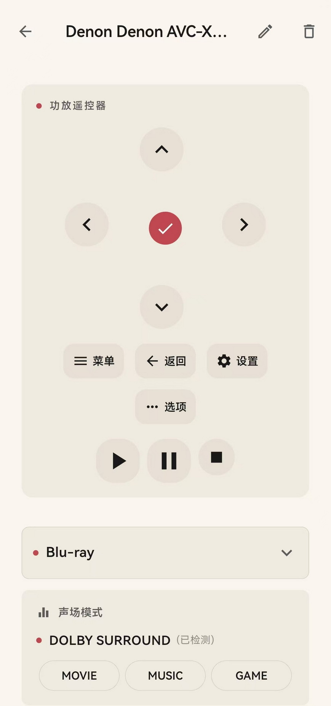
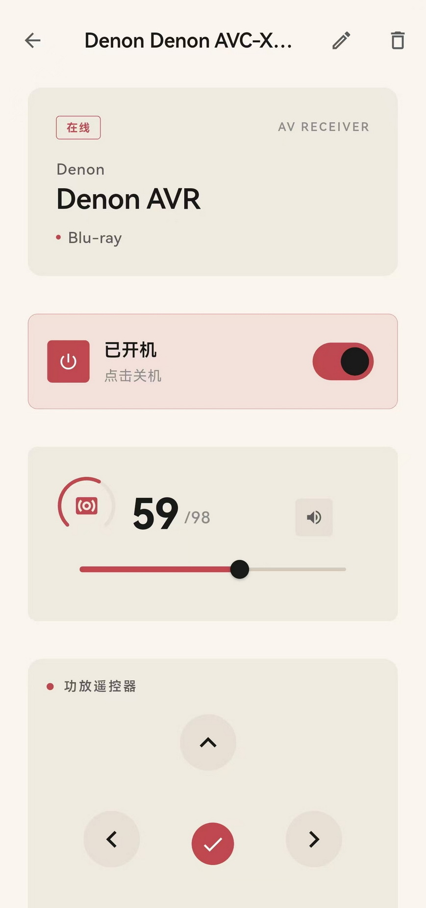
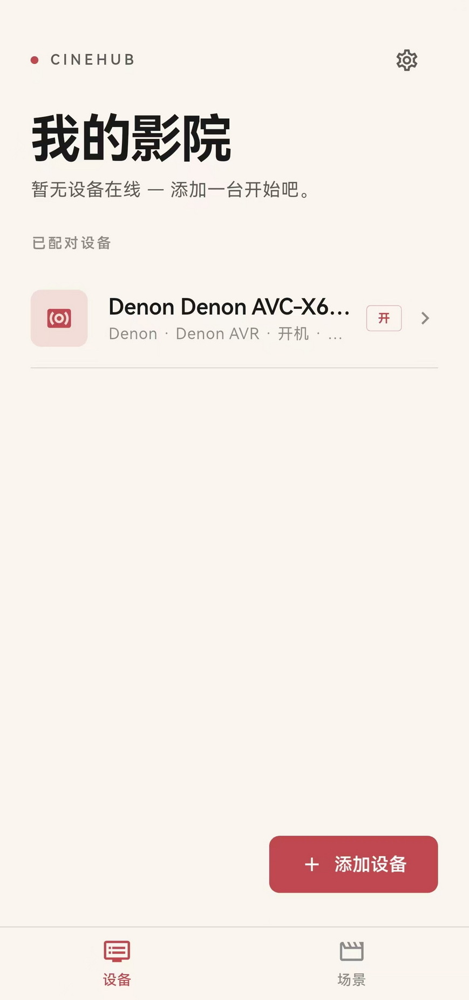
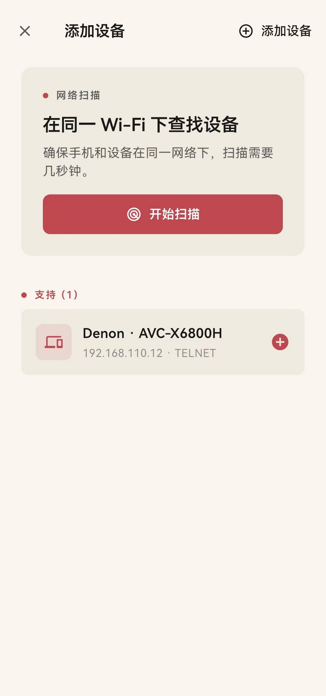
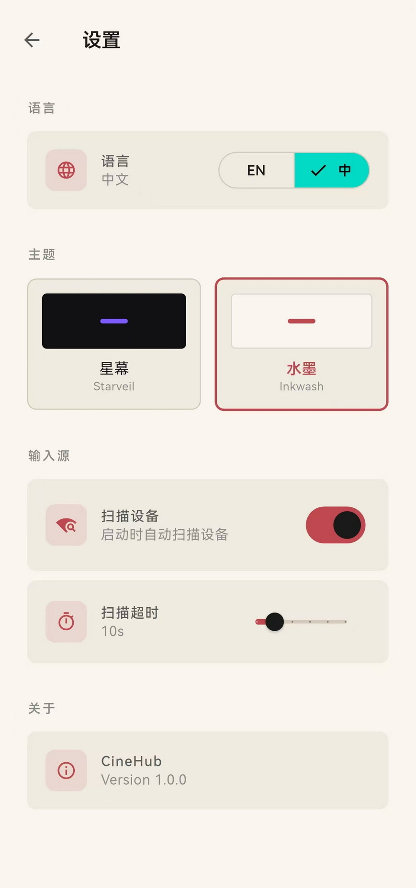

# 影控 (CineHub)

**专业家庭影院中控应用**

[English](#english) | 中文

---

## 简介

影控（CineHub）是一款纯软件家庭影院中控应用，无需购买昂贵的中控主机（如 Nice/ELAN、Control4），手机直连设备即可控制功放、电视等所有影院设备——零额外硬件成本。

## 核心功能

- **纯软件方案** — 无需中控主机，App 通过局域网直连设备，零额外硬件成本
- **设备自动发现** — 局域网扫描，一键添加设备
- **完整控制** — 开关机、音量调节、静音、输入源切换
- **声场模式** — MOVIE/MUSIC/GAME 快捷切换，当前解码模式实时显示
- **遥控器** — 方向键、菜单、返回等全功能虚拟遥控
- **一键启动应用** — 小米/红米电视支持一键打开已安装应用
- **多设备管理** — 支持添加多台设备，分区控制
- **双主题** — 星幕深色模式与水墨国风模式自由切换
- **中英双语** — 完整国际化支持

## 已支持设备

### Denon / Marantz 功放

通过 Telnet (端口23) + HTTP API 直连控制，支持全系列型号。

| 功能 | 说明 |
|------|------|
| 电源 | 开机 / 待机 |
| 音量 | 精确调节 + 步进增减 |
| 静音 | 一键静音 / 取消静音 |
| 输入源 | 动态获取功放真实输入源列表，支持切换 |
| 声场模式 | MOVIE / MUSIC / GAME 快捷切换 |
| 遥控器 | 方向键 + 主页/返回/菜单/确认 |

**支持型号**：Denon AVR-X / AVC-X 系列（AVR-X2800H、AVR-X3800H、AVR-X4800H、AVC-X6800H 等）、Marantz SR / NR 系列（SR7015、SR8015 等）

### 小米 / 红米电视

通过 HTTP (端口6095) 直连控制，支持小米电视和红米电视全系列。

| 功能 | 说明 |
|------|------|
| 电源 | 开机 / 待机 |
| 音量 | 步进增减 |
| 输入源 | HDMI 1 / HDMI 2 切换 |
| 遥控器 | 方向键 + 主页/返回/菜单/确认 |
| 启动应用 | 一键打开电视上已安装的应用 |

> ⚠️ 小米电视的信号源切换接口仅支持 HDMI 1 和 HDMI 2，其他信号源暂不支持，这是电视端 API 的限制。

## 计划支持

| 设备 | 品牌 | 协议 | 状态 |
|------|------|------|------|
| Bravia 电视 | Sony | REST API + IRCC | 计划中 |
| Smart TV | Samsung | WebSocket + JSON-RPC | 计划中 |
| Apple TV | Apple | MRP 协议 | 计划中 |
| 投影机 | Epson | ESC/VP21 | 计划中 |
| LG OLED | LG | WebSocket | 计划中 |

## 截图

| 主界面 | 设备控制 | 遥控器 |
|:---:|:---:|:---:|
|  |  |  |

| 设置 | 主题切换 |
|:---:|:---:|
|  |  |

## 适用场景

- 家庭影院
- 影音室
- 客厅音响系统

只要您的设备与手机在同一局域网，即可实现零延迟实时控制。

## 下载

前往 [Releases](https://github.com/Benjamin-LY777/cinahub/releases) 页面下载最新 APK。

## 技术栈

- Flutter 3.x
- Dart
- Denon/Marantz Telnet + HTTP 协议
- 小米电视 HTTP 6095 协议

---

# CineHub

**Professional Home Theater Control App**

中文 | [English](#english)

---

## Overview

CineHub is a pure-software home theater control app. No expensive control processor needed (like Nice/ELAN, Control4) — your phone connects directly to all theater devices over your local network at zero extra hardware cost.

## Key Features

- **Pure Software** — No control processor needed, app connects directly to devices over LAN, zero extra hardware cost
- **Auto Discovery** — Scan local network, add devices with one tap
- **Full Control** — Power, volume, mute, input source switching
- **Sound Mode** — MOVIE/MUSIC/GAME quick switch with real-time decoder display
- **Remote Control** — Full virtual remote with directional keys, menu, back
- **Quick Launch Apps** — One-tap launch for installed apps on Xiaomi/Redmi TVs
- **Multi-Device** — Control multiple devices, zone support
- **Dual Themes** — Starveil dark mode and Inkwash Chinese ink painting style
- **i18n** — English and Chinese support

## Supported Devices

### Denon / Marantz AV Receivers

Direct control via Telnet (port 23) + HTTP API. Full model range supported.

| Feature | Description |
|---------|-------------|
| Power | On / Standby |
| Volume | Precise adjustment + step up/down |
| Mute | One-tap mute / unmute |
| Input Source | Dynamic source list from receiver, full switching support |
| Sound Mode | MOVIE / MUSIC / GAME quick switch |
| Remote | D-pad + Home/Back/Menu/OK |

**Supported Models**: Denon AVR-X / AVC-X series (AVR-X2800H, AVR-X3800H, AVR-X4800H, AVC-X6800H, etc.), Marantz SR / NR series (SR7015, SR8015, etc.)

### Xiaomi / Redmi TV

Direct control via HTTP (port 6095). All Xiaomi and Redmi TV models supported.

| Feature | Description |
|---------|-------------|
| Power | On / Standby |
| Volume | Step up/down |
| Input Source | HDMI 1 / HDMI 2 switching |
| Remote | D-pad + Home/Back/Menu/OK |
| Launch Apps | One-tap launch for installed apps |

> ⚠️ Xiaomi TV's source switching API only supports HDMI 1 and HDMI 2. Other sources are not supported due to TV-side API limitations.

## Planned Support

| Device | Brand | Protocol | Status |
|--------|-------|----------|--------|
| Bravia TV | Sony | REST API + IRCC | Planned |
| Smart TV | Samsung | WebSocket + JSON-RPC | Planned |
| Apple TV | Apple | MRP Protocol | Planned |
| Projector | Epson | ESC/VP21 | Planned |
| LG OLED | LG | WebSocket | Planned |

## Download

Visit [Releases](https://github.com/Benjamin-LY777/cinahub/releases) to download the latest APK.

## Tech Stack

- Flutter 3.x
- Dart
- Denon/Marantz Telnet + HTTP Protocol
- Xiaomi TV HTTP 6095 Protocol

---

## License

MIT License

## Author

Benjamin-LY777