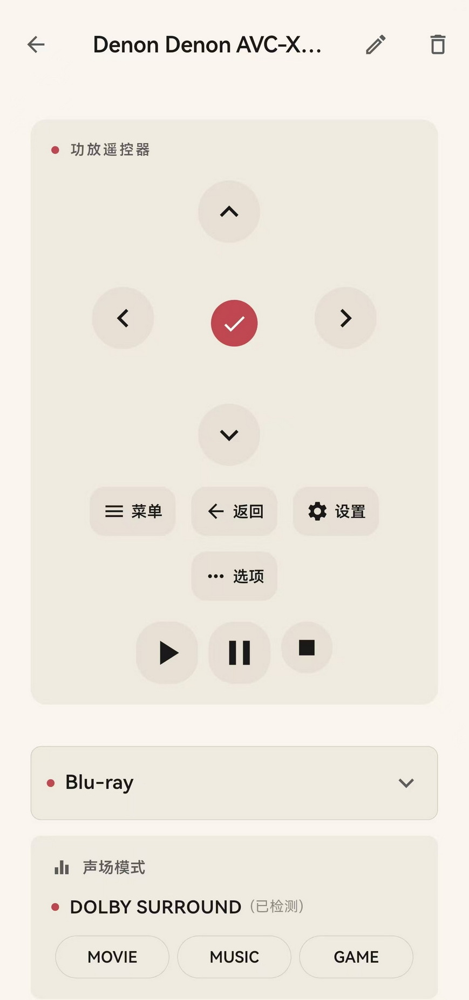
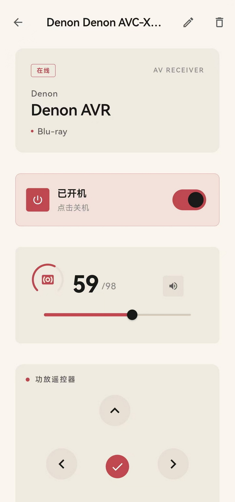
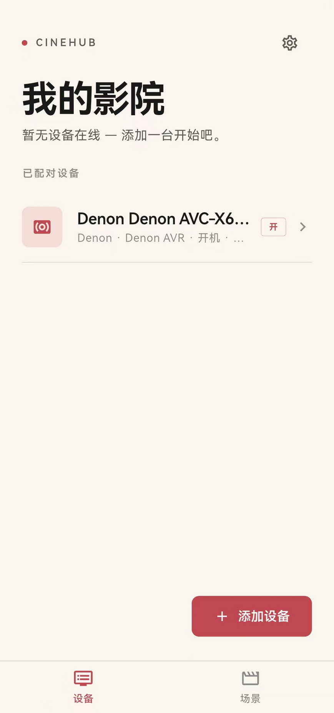
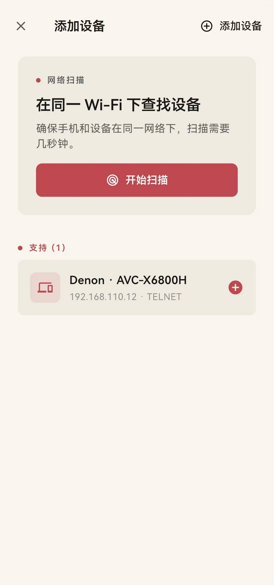
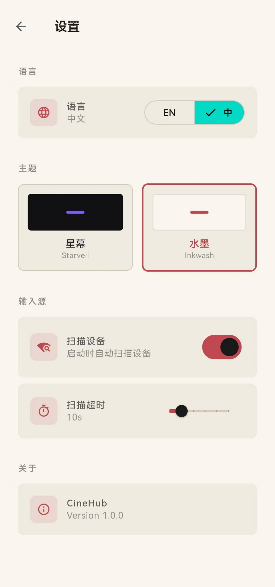

# 影控 (CineHub)

**专业家庭影院中控应用 · 手机直连，零额外硬件**

[English](#english) | 中文

---

## 简介

**影控（CinaHub）** 是一款纯软件的家庭影院 / 影音室中控应用。无需购买昂贵的中控主机（如 Nice/ELAN、Control4），手机通过局域网直连功放、电视等设备即可统一控制——**零额外硬件成本**。

- 支持中文 / English 双语，安装后自动跟随系统语言
- 三套主题随心切换：星幕（Starveil）、水墨（Inkwash）、霜璃（Frostglass 毛玻璃）
- 房间化管理：自定义房间、可选统一风格图标、设备卡片一目了然

## 核心功能

- **纯软件方案** — 无需中控主机，App 通过局域网直连设备，零额外硬件成本
- **设备自动发现** — 局域网扫描（mDNS/Bonjour），一键添加设备
- **完整控制** — 开关机、音量调节、静音、输入源切换
- **声场模式** — MOVIE / MUSIC / GAME 快捷切换，当前解码模式实时显示
- **虚拟遥控器** — 方向键、菜单、返回、确认等全功能遥控，带触感反馈
- **房间管理** — 自定义房间名称与图标（客厅 / 影音室 / 卧室 / 厨房等 12 款 Material 风格图标），设备以卡片网格展示，点击设备卡片直达控制页
- **多设备分区** — 支持添加多台设备，按房间分区控制
- **三主题** — 星幕深色 / 水墨国风 / 霜璃毛玻璃，自由切换
- **中英双语** — 跟随系统语言自动切换

## 已支持设备

### Denon / Marantz 功放

通过 Telnet（端口 23）+ HTTP API 直连控制，支持全系列型号。

| 功能 | 说明 |
|------|------|
| 电源 | 开机 / 待机 |
| 音量 | 精确调节 + 步进增减 |
| 静音 | 一键静音 / 取消静音 |
| 输入源 | 动态获取功放真实输入源列表，支持切换 |
| 声场模式 | MOVIE / MUSIC / GAME 快捷切换 |
| 遥控器 | 方向键 + 主页 / 返回 / 菜单 / 确认 |

**支持型号**：Denon AVR-X / AVC-X 系列（AVR-X2800H、AVR-X3800H、AVR-X4800H、AVC-X6800H 等）、Marantz SR / NR 系列（SR7015、SR8015 等）

### 小米 / 红米电视

通过 HTTP（端口 6095）直连控制，支持小米电视和红米电视全系列。

| 功能 | 说明 |
|------|------|
| 电源 | 开机 / 待机（含 Wake-on-LAN 唤醒） |
| 音量 | 步进增减 |
| 输入源 | HDMI 1 / HDMI 2 切换 |
| 遥控器 | 方向键 + 主页 / 返回 / 菜单 / 确认 |
| 启动应用 | 一键打开电视上已安装的应用 |

> ⚠️ 小米电视的信号源切换接口仅支持 HDMI 1 和 HDMI 2，其他信号源暂不支持，这是电视端 API 的限制。

### Samsung 智能电视

通过 WebSocket + JSON-RPC 直连控制，支持开机（Wake-on-LAN 定向广播唤醒）、关机、音量、遥控等功能。

### Apple TV

通过 Bonjour/mDNS（`_companion-link._tcp`）自动发现，支持添加、控制与虚拟遥控。

## 计划支持

| 设备 | 品牌 | 协议 | 状态 |
|------|------|------|------|
| Bravia 电视 | Sony | REST API + IRCC | 计划中 |
| 投影机 | Epson | ESC/VP21 | 计划中 |
| LG OLED | LG | WebSocket | 计划中 |

## 截图

| 主界面 | 设备控制 | 遥控器 |
|:---:|:---:|:---:|
|  |  |  |

| 房间管理 | 主题切换 |
|:---:|:---:|
|  |  |

## 适用场景

- 家庭影院 / 影音室
- 客厅音响系统
- 多房间影音设备集中控制

只要您的设备与手机在同一局域网，即可实现零延迟实时控制。

## 下载

前往 [Releases](https://github.com/Benjamin-LY777/cinahub/releases) 页面下载最新 APK（当前最新：**v1.2.1**）。

> 安装前请在系统设置中允许「未知来源」应用安装。

## 技术栈

- Flutter 3.x / Dart
- Denon/Marantz Telnet + HTTP 协议
- 小米电视 HTTP 6095 协议
- Samsung WebSocket + Wake-on-LAN
- Apple TV Bonjour/mDNS 发现

---

# CineHub

**Professional Home Theater Control App · Direct device control, zero extra hardware**

中文 | [English](#english)

---

## Overview

**CineHub** is a pure-software home theater / AV control app. No expensive control processor needed (like Nice/ELAN, Control4) — your phone connects directly to receivers, TVs and other theater devices over your local network at **zero extra hardware cost**.

- Chinese / English bilingual, follows system language automatically after install
- Three themes: Starveil (dark), Inkwash (Chinese ink), Frostglass (frosted glass)
- Room-based management: custom rooms, selectable unified icons, clear device cards

## Key Features

- **Pure Software** — No control processor needed, app connects directly to devices over LAN
- **Auto Discovery** — Scan local network (mDNS/Bonjour), add devices with one tap
- **Full Control** — Power, volume, mute, input source switching
- **Sound Mode** — MOVIE / MUSIC / GAME quick switch with real-time decoder display
- **Virtual Remote** — Full D-pad + menu/back/confirm remote with haptic feedback
- **Room Management** — Custom room names & icons (12 Material-style icons: living room, home theater, bedroom, kitchen…), devices shown as a card grid; tap a device card to jump straight to its control page
- **Multi-Device** — Control multiple devices, organized by room
- **Three Themes** — Starveil / Inkwash / Frostglass
- **i18n** — Automatic Chinese/English based on system language

## Supported Devices

### Denon / Marantz AV Receivers

Direct control via Telnet (port 23) + HTTP API. Full model range supported.

| Feature | Description |
|---------|-------------|
| Power | On / Standby |
| Volume | Precise adjustment + step up/down |
| Mute | One-tap mute / unmute |
| Input Source | Dynamic source list from receiver, full switching |
| Sound Mode | MOVIE / MUSIC / GAME quick switch |
| Remote | D-pad + Home/Back/Menu/OK |

**Supported Models**: Denon AVR-X / AVC-X series (AVR-X2800H, AVR-X3800H, AVR-X4800H, AVC-X6800H, etc.), Marantz SR / NR series (SR7015, SR8015, etc.)

### Xiaomi / Redmi TV

Direct control via HTTP (port 6095). All Xiaomi and Redmi TV models supported.

| Feature | Description |
|---------|-------------|
| Power | On / Standby (Wake-on-LAN supported) |
| Volume | Step up/down |
| Input Source | HDMI 1 / HDMI 2 switching |
| Remote | D-pad + Home/Back/Menu/OK |
| Launch Apps | One-tap launch for installed apps |

> ⚠️ Xiaomi TV's source switching API only supports HDMI 1 and HDMI 2 due to TV-side limitations.

### Samsung Smart TV

Control via WebSocket + JSON-RPC: power (Wake-on-LAN directed broadcast), volume, remote, etc.

### Apple TV

Auto-discovered via Bonjour/mDNS (`_companion-link._tcp`); add, control and use the virtual remote.

## Planned Support

| Device | Brand | Protocol | Status |
|--------|-------|----------|--------|
| Bravia TV | Sony | REST API + IRCC | Planned |
| Projector | Epson | ESC/VP21 | Planned |
| LG OLED | LG | WebSocket | Planned |

## Download

Visit [Releases](https://github.com/Benjamin-LY777/cinahub/releases) to download the latest APK (current: **v1.2.1**).

> Enable "Install from unknown sources" in system settings before installing.

## Tech Stack

- Flutter 3.x / Dart
- Denon/Marantz Telnet + HTTP Protocol
- Xiaomi TV HTTP 6095 Protocol
- Samsung WebSocket + Wake-on-LAN
- Apple TV Bonjour/mDNS Discovery

---

## License

MIT License

## Author

Benjamin-LY777
